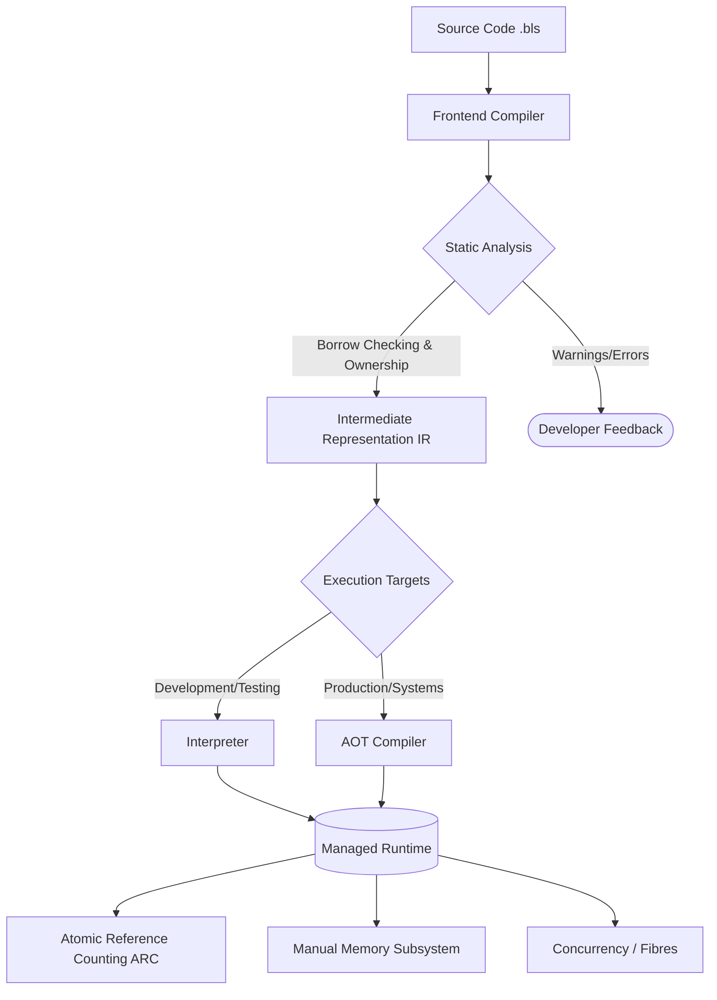
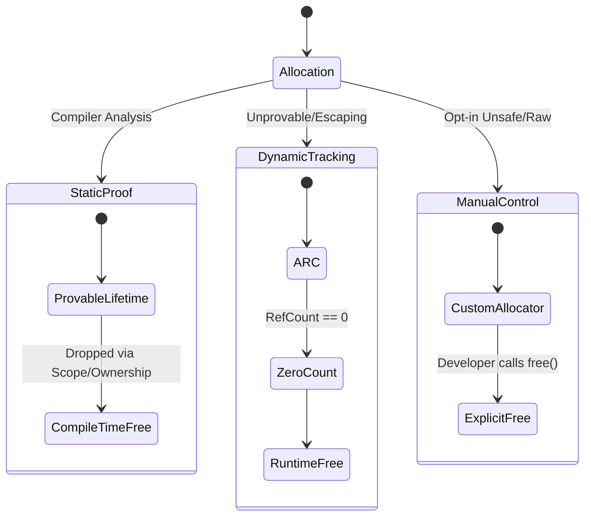

# ⚡ bliss-4i

> **A language laboratory exploring the intersection of static analysis, reference counting, and manual memory management.**

[](https://opensource.org/licenses/Apache-2.0)
[]()

**bliss-4i** is an experimental research project focused on systems-oriented language design, compiler architecture, and full-pipeline execution. 

⚠️ **Current Status:** *Active research and prototyping phase. Expect breaking changes, experimental semantics, and incomplete documentation.*

---

## 🔍 What is this project about?

Bliss is not just a language syntax; it is a full ecosystem designed to prototype ideas around safety, predictable performance, and explicit control at both compile time and runtime. Its primary purpose is to understand how modern languages are built end-to-end.

Rather than forcing a single execution paradigm, the Bliss platform is architected to consist of a **managed runtime, an interpreter, and an Ahead-of-Time (AOT) compiler**. It targets the same problem domains as traditional systems languages—such as runtimes, engines, OS components, and low-level services.

### The Pipeline Architecture

Below is a high-level visualization of how the bliss-4i pipeline handles code from source to execution:



---

## 🧠 The Bliss Philosophy

Bliss is built around a few uncompromising core ideas:

* **Explicit Over Implicit:** Nothing happens "magically" at runtime unless you opt into it. Memory ownership, borrowing, and movement are visible concepts.
* **Layered Safety:** Instead of forcing a single paradigm, Bliss supports multiple, composable safety layers.
* **Pay Only for What You Use:** Features like atomic reference counting and runtime checks are opt-in. The compiler entirely removes unused safety layers.
* **Runtime Transparency:** You always know where memory is allocated, who owns it, and when/why it is freed. No hidden GC cycles.

---

## 🧬 The "4i" Convention

"4i" refers to the **fourth iteration** of the language and runtime architecture. Earlier iterations explored pure manual management, pure reference counting, and strict ownership. This version unifies all three into a multi-layer deallocation model.

The compiler analyzes the code and chooses the fastest valid strategy for freeing objects:



1. **Static Proof (Compile-time):** Tracks ownership chains and lifetimes. Rule violations can be configured as warnings rather than hard errors, allowing runtime fallbacks.
2. **Reference Counting (ARC):** Automatic memory reclamation when statically unprovable. Atomic by default, but downgradeable in single-threaded contexts.
3. **Explicit `free`:** Full manual control with custom allocators and raw memory layouts for ultimate systems-level performance.

---

## 💻 Conceptual Examples

**Ranges & Iteration**

```bliss
// Ranges are explicit and make iteration intuitive
for (int i; 0 <= i < 5; i++) {
    // ...
}

if (a < b <= c) {
    // Range operator logic
}

```

**Scoping & Visibility**

```bliss
scope Math;

fx privateStuff() {
    // Cannot be accessed because it is not under any scope.
};

// Define a sub-scope
Math::SubScope::{
    // ...
};

Math::{
    // Private by default
    fx add(int a, int b): int {
        return a + b;
    }
    
    fx doSomeStuff() {
        privateStuff(); // This is valid.
    }
};

pub fx Math::sub(int a, int b): int {
    return a - b;
};

```

*(Note: Exact syntax is subject to change as the language evolves.)*

---

## 🏗️ Repository Structure

```text
bliss-4i/
├── compiler/        # Frontend + type system + borrow analysis
├── runtime/         # Memory manager, RC implementation, 
├── stdlib/          # Core language library
├── tests/           # Compiler + runtime tests
├── examples/        # Example programs
├── docs/            # Design documents
└── tools/           # Build tools and experiments

```

---

## 🛑 Non-Goals

Bliss intentionally does **not** aim to:

* Be simple or beginner-friendly.
* Serve as a rapid prototyping or general-purpose scripting language.
* Hide memory management.
* Replace mainstream production languages.

---

## 🔒 Contributing

**At this time, I am not accepting Pull Requests (PRs) or external code contributions.** This repository operates strictly as a personal research and language laboratory. Because the architecture, syntax, and memory models are undergoing rapid, experimental iterations, external contributions are currently closed to maintain a focused development trajectory.

However, if you are interested in compiler design, memory models, runtime systems, or programming language theory, **discussions, issues, and design feedback are highly welcome!**

---

**A note on AI usage:** AI tools are used strictly as a development aid (summarizing research papers, discovering language designs, debugging, and documentation). All architectural decisions, implementations, and experiments are reviewed, directed, and authored by a human.